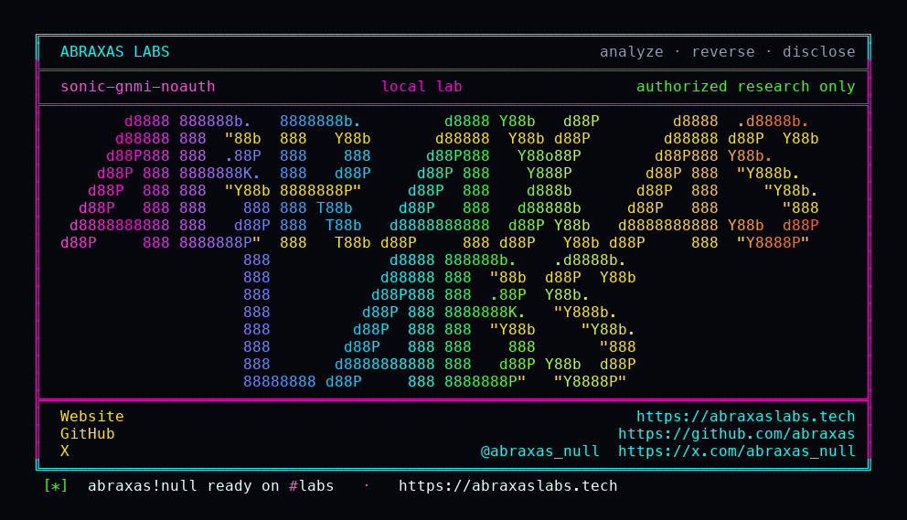

<p align="center">
  
</p>

<p align="center">
  <a href="https://abraxaslabs.tech"><strong>abraxaslabs.tech</strong></a>
  &nbsp;·&nbsp;
  <a href="https://github.com/abraxas">github.com/abraxas</a>
  &nbsp;·&nbsp;
  <a href="https://x.com/abraxas_null">@abraxas_null</a>
  &nbsp;·&nbsp;
  <a href="mailto:abraxas.null@proton.me">abraxas.null@proton.me</a>
  &nbsp;·&nbsp;
  <a href="https://github.com/abraxas/sonic-gnmi-noauth">sonic-gnmi-noauth</a>
</p>

# sonic-gnmi-noauth

**SONiC gNMI** `f13a08e0440f` - SONiC Foundation / sonic-net

Community SONiC NOS. Not Dell Enterprise SONiC. Not SonicWall SonicOS. The committee [does not issue CVEs](https://github.com/sonic-net/SONiC/blob/master/SECURITY.md). [`gnmi-native.sh`](https://github.com/sonic-net/sonic-buildimage/blob/9495839742e4/dockers/docker-sonic-gnmi/gnmi-native.sh) knows that omitting `--client_auth` used to disable authentication entirely, so when `user_auth` is missing it forces cert mode. Fail-closed. Then it never passes `--ca_crt` when certs are absent. [`setupFlags`](https://github.com/sonic-net/sonic-gnmi/blob/f13a08e0440f/telemetry/telemetry.go) unsets cert because there is no CA. [`authenticate()`](https://github.com/sonic-net/sonic-gnmi/blob/f13a08e0440f/gnmi_server/server.go) treats the empty map as success. Native and translib writes stay compiled in (`ENABLE_NATIVE_WRITE=y`). Two production flag sets, same skip: default ToR `--noTLS --bind_address 127.0.0.1`; SmartSwitch DPU `--insecure --allow_no_client_auth`, empty bind, all interfaces, port 8080.

**Empty `UserAuth` after the cert unset is unauthenticated gNMI Set and gNOI writes. DPU with no certs is remote on `:8080`.**

| | |
|---|---|
| ID | no CVE yet |
| CWE | [CWE-306](https://cwe.mitre.org/data/definitions/306.html), [CWE-287](https://cwe.mitre.org/data/definitions/287.html) |
| CVSS | **Critical: 9.8** `CVSS:3.1/AV:N/AC:L/PR:N/UI:N/S:U/C:H/I:H/A:H` (DPU no-cert). Default ToR is the same skip on `127.0.0.1:8080` (High, local). |
| Product | [sonic-gnmi](https://github.com/sonic-net/sonic-gnmi) / [sonic-buildimage](https://github.com/sonic-net/sonic-buildimage) |
| Affected | sonic-gnmi through **master f13a08e0440f**; launcher **9495839742e4** |
| Auth | unauthenticated |
| License | [GNU Affero GPL v3.0](LICENSE) |
| Lab | `127.0.0.1` only |

## What an attacker can do

On a SmartSwitch DPU with no gNMI certs: from the network, TCP `:8080`, no JWT, no PAM, no client cert. Call `gnmi.gNMI/Set` (native CONFIG_DB / translib). Call `gnoi.debug.Debug`. Reboot. Factory reset. `File.Put` under `/tmp`, `/var/tmp`, `/host`.

On a default ToR/leaf with no certs: any process that can hit `127.0.0.1:8080` does the same. The gnmi container is host net, so that loopback is the host's.

That is switch config rewrite, and host commands as `admin`, without authenticating. Debug whitelist includes `docker`, `config`, `redis-cli`, `sonic-installer`, `reboot`. Default `admin` is in `docker` and `%sudo`. Not the documented default `admin` password. `KillProcess` still returns Unauthenticated on empty `UserAuth`. Do not use that as the success oracle.

## How I found it

I read [SECURITY.md](https://github.com/sonic-net/SONiC/blob/master/SECURITY.md) first. `sonic-net/SONiC` is the wiki. The code is sibling `sonic-net/*` trees. Then ten hunts on those pins: CLI injection, REST auth, gNMI Set, hostcfgd PAM, RESTCONF, ZTP, image Redis/sshd/sudo, FEATURE defaults, GCU/SSTI, DHCP/LLDP/SNMP. No live switch. The bar was Critical/High.

Most of that bar is already closed or not default. `sonic-restapi` is `INCLUDE_RESTAPI ?= n`. RESTCONF's production launcher forces PAM. Host Redis is `127.0.0.1` with no `requirepass`, which is a first hop, not a finding. The gnmi container is not optional. `INCLUDE_SYSTEM_GNMI = y`. FEATURE gnmi is enabled. Host net, host pid, host userns.

I did not stand up a full `sonic-vs` image. The lab is a thin gRPC wrapping SHA256-checked extracts of `setupFlags` and `authenticate()` from pin `f13a08e0440f`. Both listeners returned `SONIC-GNMI-NOAUTH-WITNESS` with `auth_enabled=false` and `enable_native_write=true`. Password `UserAuth` with no creds is Unauthenticated. That is the real skip, not a stub that always succeeds.

Wrong turns already recorded: `KillProcess` Unauthenticated (that RPC already rejects empty `UserAuth` - lab requires Set-path `authenticate()` skip); Probe OK when password `UserAuth` is on and no creds (then the oracle is a stub); a gNOI Debug docker gadget, nsenter payload, reverse shell. Theatre. Pointing this at a Dell Enterprise SONiC box, or a SonicWall. Wrong product.

## Lab

```bash
cd lab
./run.sh
```

Target **only** `127.0.0.1:18080` (ToR plaintext) and `127.0.0.1:18081` (DPU TLS-insecure). Thin gRPC, not a full DPU image. Pin extracts hashed at build against sonic-gnmi `f13a08e0440f`.

```text
IOC tor-connect 127.0.0.1:18080 plaintext no-metadata
IOC tor-check witness=SONIC-GNMI-NOAUTH-WITNESS auth_enabled=false enable_native_write=true user_auth_any=false mode=tor
IOC dpu-connect 127.0.0.1:18081 tls-insecure no-client-cert no-metadata
IOC dpu-check witness=SONIC-GNMI-NOAUTH-WITNESS auth_enabled=false enable_native_write=true user_auth_any=false mode=dpu
IOC tor-negative status=UNAUTHENTICATED
IOC dpu-negative status=UNAUTHENTICATED
SUCCESS SONIC-GNMI-NOAUTH who=unauth tor=18080 dpu=18081 SONIC-GNMI-NOAUTH-WITNESS
```

## The fix

If `UserAuth` is empty after stripping cert, do not serve Set/gNOI write, or do not listen off loopback. Copy `UserAuth` on the `--noTLS` path too. Provision server certs and a CA so `--ca_crt` is set and cert mode is not unset. Do not run SmartSwitch DPU no-cert (`--insecure --allow_no_client_auth` with empty CA) on a reachable `:8080`. Both listeners must return Unauthenticated for empty `UserAuth` on the write path.

## References

- [sonic-gnmi f13a08e0440f](https://github.com/sonic-net/sonic-gnmi/tree/f13a08e0440f) · [`telemetry.go`](https://github.com/sonic-net/sonic-gnmi/blob/f13a08e0440f/telemetry/telemetry.go) · [`server.go`](https://github.com/sonic-net/sonic-gnmi/blob/f13a08e0440f/gnmi_server/server.go) · [`whitelist.go`](https://github.com/sonic-net/sonic-gnmi/blob/f13a08e0440f/pkg/gnoi/debug/whitelist.go) · [`command.go`](https://github.com/sonic-net/sonic-gnmi/blob/f13a08e0440f/internal/exec/command.go)
- [sonic-buildimage 9495839742e4](https://github.com/sonic-net/sonic-buildimage/tree/9495839742e4) · [`gnmi-native.sh`](https://github.com/sonic-net/sonic-buildimage/blob/9495839742e4/dockers/docker-sonic-gnmi/gnmi-native.sh) · [`rules/config`](https://github.com/sonic-net/sonic-buildimage/blob/9495839742e4/rules/config) · [`init_cfg.json.j2`](https://github.com/sonic-net/sonic-buildimage/blob/9495839742e4/files/build_templates/init_cfg.json.j2)
- [SECURITY.md](https://github.com/sonic-net/SONiC/blob/master/SECURITY.md)
- [CWE-306](https://cwe.mitre.org/data/definitions/306.html) · [CWE-287](https://cwe.mitre.org/data/definitions/287.html)

## License

GNU Affero GPL v3.0. See [LICENSE](LICENSE). Loopback lab only. No warranty.
